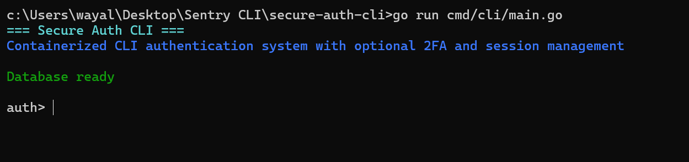
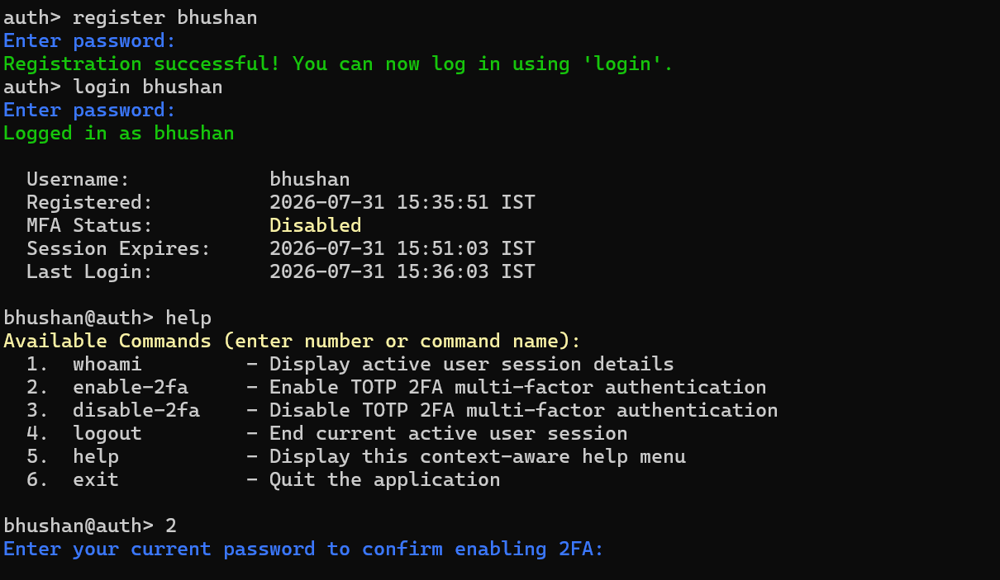
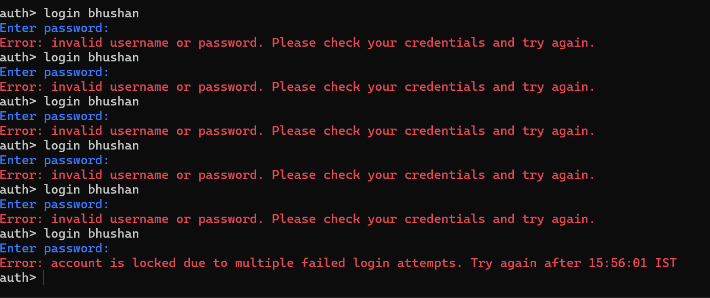
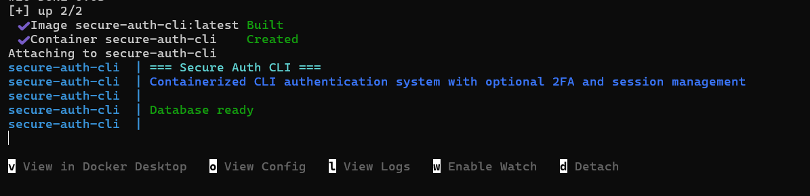

# Secure Auth CLI (`secure-auth-cli`)

[](https://golang.org)
[](https://www.docker.com/)
[-003B57?style=flat-square&logo=sqlite)](https://modernc.org/sqlite)

## Overview

`secure-auth-cli` is a production-grade, containerized command-line authentication system written in Go, featuring user registration, bcrypt password hashing, account lockout protection, token-backed session management, and Google Authenticator-compatible RFC 6238 TOTP 2FA. Built specifically for Osto's Golang Backend Intern take-home assignment, it operates entirely as an interactive REPL shell with zero external CGo dependencies. The project includes embedded database migrations, multi-stage Docker compilation, and a scenario-based E2E test harness.

---

## Screenshots







---

## Architecture

```text
secure-auth-cli/
├── cmd/
│   └── cli/
│       └── main.go           # CLI application entrypoint & startup initialization
├── internal/
│   ├── auth/                 # User registration, bcrypt password hashing, login, & lockout
│   ├── db/                   # Pure-Go SQLite connection pool & embedded SQL migration runner
│   ├── session/              # 32-byte token generation, validation, & lazy session cleanup
│   ├── shell/                # Interactive REPL shell, readline integration, & command routing
│   └── totp/                 # RFC 6238 TOTP secret generation, validation, & ANSI QR code rendering
├── migrations/
│   ├── 0001_init.sql         # Initial DDL table schema for users, sessions, & migrations
│   └── migrations.go         # go:embed package directive embedding SQL files into binary
├── tests/
│   └── e2e_tests.sh          # Scenario-based expect test harness for automated E2E testing
├── .dockerignore              # Docker build context exclusions
├── .gitignore                # Binary, database, and local environment git exclusions
├── Dockerfile                # Multi-stage CGo-free Alpine container build specification
├── docker-compose.yml        # Docker Compose configuration with interactive TTY and volume
├── go.mod                    # Go module definition
└── go.sum                    # Dependency checksum manifest
```

### Subpackage Responsibilities (`internal/`)
- `internal/auth`: Manages user credentials, bcrypt password hashing (cost 10), login verification, and failed attempt lockout tracking.
- `internal/db`: Initializes pure-Go SQLite connections (`modernc.org/sqlite`) and executes embedded SQL migrations idempotently.
- `internal/session`: Generates cryptographically secure 32-byte session tokens, handles expiration validation, and performs lazy session deletion.
- `internal/shell`: Drives the interactive Read-Eval-Print Loop (REPL), readline line editing, colored feedback, numeric shortcuts, and context-aware help menus.
- `internal/totp`: Generates base32 TOTP secrets, renders terminal ANSI QR codes (`qrterminal/v3`), and validates 6-digit 2FA codes (`pquerna/otp`).

---

## Setup

### Environment Variables & Defaults

| Variable | Default | Description |
| :--- | :--- | :--- |
| `DB_PATH` | `./data/auth.db` | Path to the SQLite database file |
| `SESSION_TIMEOUT_MINUTES` | `15` | Session token validity duration in minutes |
| `LOCKOUT_THRESHOLD` | `5` | Failed login attempts allowed before account lockout |
| `LOCKOUT_DURATION_MINUTES` | `15` | Account lockout duration in minutes |

---

### Docker Path (Recommended)

Run the application inside a multi-stage, containerized Alpine environment with persistent volume storage:

```bash
docker compose run --rm secure-auth-cli
```

**Build Output:**
```text
[+] Building 23.5s (18/18) FINISHED
 => [internal] load build definition from Dockerfile
 => => transferring dockerfile: 1.15kB
 => [builder 1/6] FROM docker.io/library/golang:alpine
 => [stage-1 2/4] RUN apk --no-cache add ca-certificates tzdata
 => [builder 3/6] COPY go.mod go.sum ./
 => [builder 4/6] RUN go mod download
 => [builder 5/6] COPY . .
 => [builder 6/6] RUN go build -ldflags="-s -w" -o /app/secure-auth-cli ./cmd/cli
 => [stage-1 4/4] COPY --from=builder /app/secure-auth-cli /app/secure-auth-cli
 => naming to docker.io/library/secure-auth-cli:latest

=== Secure Auth CLI ===
Containerized CLI authentication system with optional 2FA and session management

Database ready

auth> 
```

---

### Local Development Path

Ensure Go 1.24+ is installed locally, then run:

```bash
cd secure-auth-cli
go run cmd/cli/main.go
```

**Output:**
```text
=== Secure Auth CLI ===
Containerized CLI authentication system with optional 2FA and session management

Database ready

auth> 
```

---

## Feature Walkthroughs

### a. User Registration

**Success Case:**
```text
auth> register alice
Enter password: 
Registration successful! You can now log in using 'login'.
```

**Duplicate Username Rejection (Immediate pre-password check):**
```text
auth> register alice
Error: user 'alice' already exists. Try logging in using 'login alice'
```

---

### b. User Login & Auto-Displayed Session Details

Logging in automatically displays the styled user details block upon success:

```text
auth> login alice
Enter password: 
Logged in as alice

  Username:            alice
  Registered:          2026-07-31 15:10:09 IST
  MFA Status:          Disabled
  Session Expires:     2026-07-31 15:25:44 IST
  Last Login:          2026-07-31 15:10:44 IST

alice@auth> 
```

---

### c. Wrong Password Rejection

Returns a generic credentials error without leaking account existence:

```text
auth> login alice
Enter password: 
Error: invalid username or password. Please check your credentials and try again.
```

---

### d. Account Lockout Protection

Failing 5 consecutive login attempts locks the account and displays the unlock timestamp:

```text
auth> login alice
Enter password: 
Error: invalid username or password. Please check your credentials and try again.
...
auth> login alice
Enter password: 
Error: account is locked due to multiple failed login attempts. Try again after 15:26:18 IST
```

---

### e. Enabling TOTP 2FA

Requires password re-authentication, renders terminal QR code, prints base32 secret, and validates passcode before persisting:

```text
alice@auth> enable-2fa
Enter your current password to confirm enabling 2FA: 

Scan the QR code below with your authenticator app (Google Authenticator / Authy):
▄▄▄▄▄▄▄▄▄▄▄▄▄▄▄▄▄▄▄▄▄▄▄▄▄▄▄▄▄▄▄▄▄▄▄▄▄▄▄▄▄▄▄
█ ▄▄▄▄▄ ██ ██  ▄ ▄▀▀  ▄  ▀▀▀  ▀▀ ▀█ ▄▄▄▄▄ █
█ █   █ █▄ ▄▄▀▀▀ ▀▀▀▀▄▀▀ ██▄█ █▄ ▄█ █   █ █
█ █▄▄▄█ ████▀██ ▀▀▀▄▀█▄ ▀▀▄█ ▀▀▀ ▀█ █▄▄▄█ █
█▄▄▄▄▄▄▄█ █ █ ▀▄▀▄▀ █ ▀ █▄▀▄▀ ▀ █ █▄▄▄▄▄▄▄█
█   █▄▄▄▄ ▀█ ▄ ███▄▄   ▀█ ▄█▀ ▄▀▄ ▄ ██▀▄█▀█
█  ▀▀▀▀▄ █▀█ ▄  ▀▀  ▀▄ █▀ ▀▀▀ ▀▀▀▀ █▄▀█▄▄▄█
█▄█▄██▄▄█▀ █▄▀▄▀▄▀▄█▄█ █▄█ ██  ▀▀ ▄▄▄ ▄█▀ █
█ ▄▄▄▄▄ █  ▄▀▀▄█▀█  ▀▀ ▄▀▀▀▀▀  █  █▄█ █▄▄ █
█ █   █ █▄█▀▀█▀█      █▀▀   █  ▀▀▄▄▄▄ ██▀▄█
█ █▄▄▄█ █ ▀▄▀█▀▀█  ▀▀ ▀▄▀▀  ██▀▀▀  █▀▄▄▄▀██
█▄▄▄▄▄▄▄█▄█▄█▄▄██▄▄██▄▄██▄▄███▄█▄▄█▄██▄█▄▄█
Secret Key (manual entry): ZME5IJESOFOD2TOHFNEKW2K6NZSQYC3L

Enter the 6-digit code from your authenticator app to confirm: 593321
2FA enabled successfully!
```

---

### f. Login with TOTP 2FA

Prompting for 6-digit authenticator code after successful password verification:

```text
auth> login alice
Enter password: 
Enter your 6-digit authenticator code: 037863
Logged in as alice

  Username:            alice
  Registered:          2026-07-31 15:10:09 IST
  MFA Status:          Enabled
  Session Expires:     2026-07-31 15:30:00 IST
  Last Login:          2026-07-31 15:15:00 IST

alice@auth> 
```

---

### g. Disabling 2FA

Requires password re-authentication before clearing 2FA secret:

```text
alice@auth> disable-2fa
Enter your current password to confirm disabling 2FA: 
2FA disabled successfully.
```

---

### h. Lazy Session Expiration

Rejects expired session tokens on command execution and resets prompt to `auth>`:

```text
alice@auth> whoami
Error: session expired or invalid, please log in again

auth> 
```

---

### i. User Logout

Terminates session record in database and returns prompt to `auth>`:

```text
alice@auth> logout
Logged out successfully.

auth> 
```

---

### j. Context-Aware Help Menu

**Pre-Login Help (`auth>`):**
```text
auth> help
Available Commands (enter number or command name):
  1.  register       - Register a new user account
  2.  login          - Login with username and password (+ 2FA if enabled)
  3.  help           - Display this context-aware help menu
  4.  exit           - Quit the application
```

**Post-Login Help (`alice@auth>`):**
```text
alice@auth> help
Available Commands (enter number or command name):
  1.  whoami         - Display active user session details
  2.  enable-2fa     - Enable TOTP 2FA multi-factor authentication
  3.  disable-2fa    - Disable TOTP 2FA multi-factor authentication
  4.  logout         - End current active user session
  5.  help           - Display this context-aware help menu
  6.  exit           - Quit the application
```

---

### k. Docker Compose Persistence Demonstration

```bash
# Step 1: Register user inside container
docker compose run --rm secure-auth-cli
auth> register dockeruser
Enter password: Pass1234!
Registration successful! You can now log in using 'login'.
auth> exit

# Step 2: Tear down container network
docker compose down
Network secure-auth-cli_default Removed

# Step 3: Re-launch container and verify login persistence
docker compose run --rm secure-auth-cli
auth> login dockeruser
Enter password: Pass1234!
Logged in as dockeruser

  Username:            dockeruser
  Registered:          2026-07-31 09:45:38 UTC
  MFA Status:          Disabled
  Session Expires:     2026-07-31 10:01:17 UTC
  Last Login:          2026-07-31 09:46:17 UTC
```

---

## Command Reference

| Command | Numeric Shortcut | Availability | Description |
| :--- | :---: | :---: | :--- |
| `register [username]` | `1` | Pre-Login | Registers a new user account with bcrypt password hashing |
| `login [username]` | `2` | Pre-Login | Authenticates user credentials and checks TOTP if enabled |
| `whoami` | `1` | Post-Login | Displays formatted user registration and session metadata |
| `enable-2fa` | `2` | Post-Login | Generates TOTP secret, renders terminal QR code, & enables 2FA |
| `disable-2fa` | `3` | Post-Login | Requires password re-authentication and disables 2FA |
| `logout` | `4` | Post-Login | Ends active session in database and resets prompt to `auth>` |
| `help` | `3` / `5` | All States | Displays context-aware command descriptions and shortcuts |
| `exit` | `4` / `6` | All States | Terminates interactive session cleanly |

---

## Security Design Notes

- **Password Storage**: Uses `golang.org/x/crypto/bcrypt` with a cost factor of `10`. Plaintext passwords are never stored or logged.
- **Account Lockout**: Failed attempts increment `failed_login_attempts`. Crossing `LOCKOUT_THRESHOLD` (5) locks the account (`locked_until = now + 15m`). `locked_until` is checked BEFORE performing bcrypt hash comparisons to prevent CPU exhaustion attacks.
- **Session Tokens**: Generates 32-byte cryptographically secure random data (`crypto/rand`) hex-encoded as a 64-character token. Tokens are stored in SQLite and validated on every post-login command execution.
- **RFC 6238 TOTP 2FA**: Uses `github.com/pquerna/otp/totp` with a standard 30-second step window and clock-skew tolerance. Implements a confirm-before-enable security pattern requiring passcode confirmation before persisting the secret.

---

## Design Decisions

- **Pure-Go SQLite (`modernc.org/sqlite`)**: Selected over `mattn/go-sqlite3` to eliminate CGo compiler requirements (`CGO_ENABLED=0`), enabling lightweight multi-stage Docker compilation without GCC in the container.
- **Embedded Migrations (`go:embed`)**: DDL SQL migrations (`migrations/0001_init.sql`) are embedded directly into the binary at compile time, guaranteeing schema idempotency without external migration tools.
- **Minimal Alpine Runtime**: `alpine:latest` was selected for the final stage to include runtime CA certificates (`ca-certificates`) and timezone databases (`tzdata`) while keeping final image size under 35 MB.
- **Unit & E2E Test Suite**: Built unit tests for `auth`, `session`, and `totp` alongside a scenario-based `expect` test harness to ensure cross-platform test coverage.

---

## Testing

### Automated Unit Tests

Run all unit tests across internal packages:

```bash
go test -v ./...
```

**Test Output:**
```text
=== RUN   TestRegister
--- PASS: TestRegister (0.16s)
=== RUN   TestLoginAndLockout
--- PASS: TestLoginAndLockout (0.47s)
PASS
ok  	secure-auth-cli/internal/auth	2.252s

=== RUN   TestCreateAndValidateSession
--- PASS: TestCreateAndValidateSession (0.00s)
=== RUN   TestSessionExpiration
--- PASS: TestSessionExpiration (0.00s)
=== RUN   TestLogout
--- PASS: TestLogout (0.00s)
PASS
ok  	secure-auth-cli/internal/session	1.933s

=== RUN   TestGenerateSecretAndValidate
--- PASS: TestGenerateSecretAndValidate (0.00s)
PASS
ok  	secure-auth-cli/internal/totp	1.100s
```

### End-to-End Expect Test Harness ([tests/e2e_tests.sh](file:///c:/Users/wayal/Desktop/Sentry%20CLI/secure-auth-cli/tests/e2e_tests.sh))

The repository includes a 18-scenario POSIX Bash test harness driven by `expect` for interactive TTY verification:

```bash
chmod +x tests/e2e_tests.sh
./tests/e2e_tests.sh
```

**Coverage**: Registers users, checks duplicate rejections, validates login, triggers lockout, verifies 2FA setup and passcode rejection, checks session timeouts, and confirms clean exit codes.
